# 📊 Dashboard de Visualização de Dados

> Dashboard interativo de análise de pedidos construído com **Streamlit** e **Plotly**, com sistema de temas dinâmicos, filtros avançados e múltiplas visualizações.

---

## 🖼️ Sobre o Projeto

Este projeto é um dashboard de exploração e visualização de dados de pedidos (e-commerce), permitindo análises visuais através de gráficos interativos, mapas geográficos e filtros dinâmicos.

### 📈 Exploração dos Dados

A análise dos dados revelou insights sobre o comportamento de pedidos:

- **Distribuição de Status**: A grande maioria dos pedidos possui status `delivered` (entregue), mostrando uma taxa de entrega consistente. Outros status como `shipped`, `canceled` e `processing` aparecem em menor proporção.
- **Padrões Temporais**: Os dados mostram variações sazonais no volume de pedidos ao longo dos meses, com picos identificáveis em determinados períodos — visíveis na granularidade mensal, semanal e diária.
- **Geolocalização**: O mapa de calor geográfico revela concentração de pedidos nas regiões Sudeste e Sul do Brasil, com São Paulo sendo o principal polo.
- **KPIs em Tempo Real**: O dashboard calcula automaticamente métricas como total de pedidos, status mais comum, quantidade de status únicos e taxa de entrega.

---

## 📸 Telas do Dashboard (Prints)

Aqui estão as demonstrações visuais das diversas funcionalidades do dashboard:

### 🏠 Visão Geral & Menus
<p align="center">
  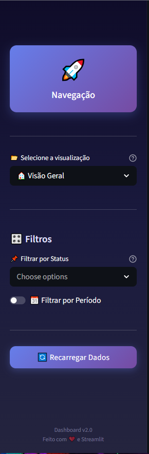
  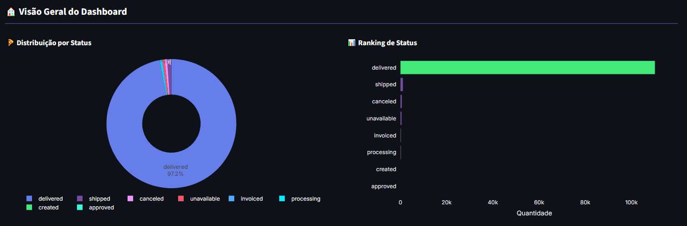
  <br>
  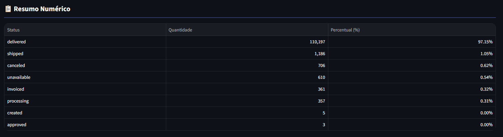
  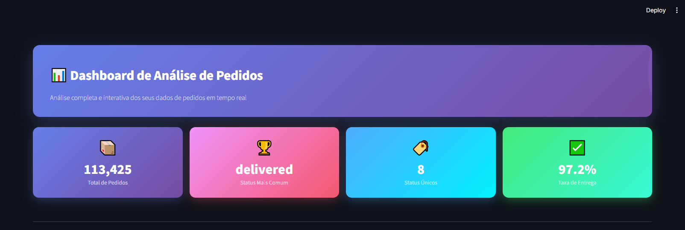
</p>

### 📊 Gráficos e Análises Detalhadas
<p align="center">
  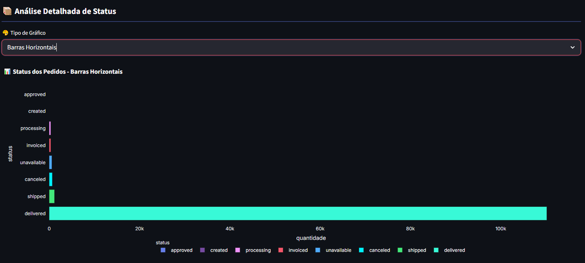
  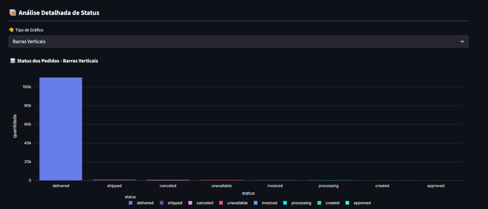
  <br>
  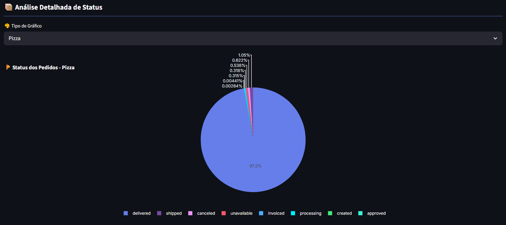
  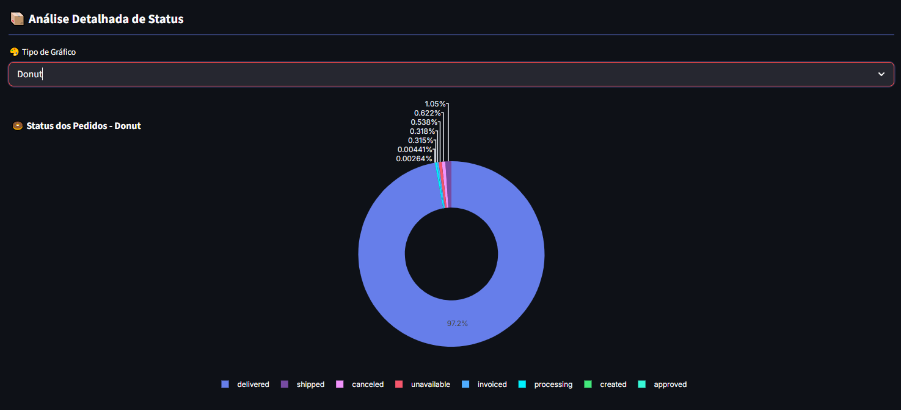
  <br>
  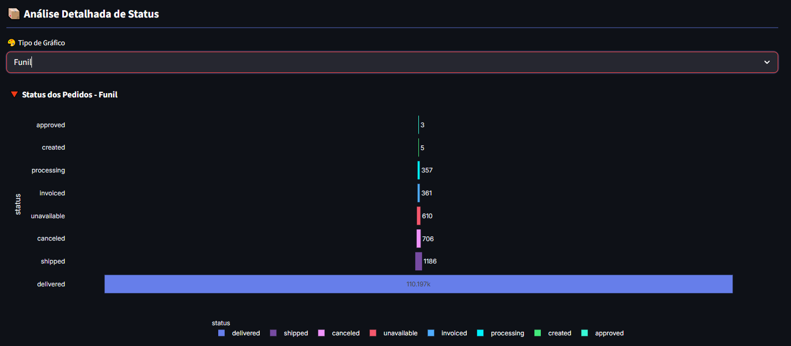
  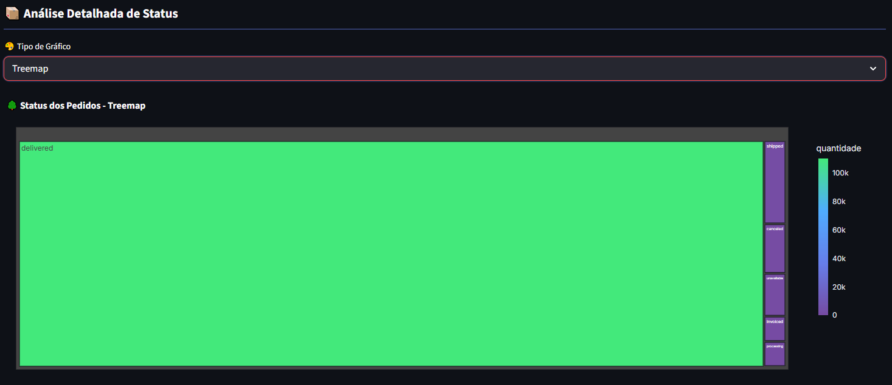
</p>

### 📈 Análise Temporal
<p align="center">
  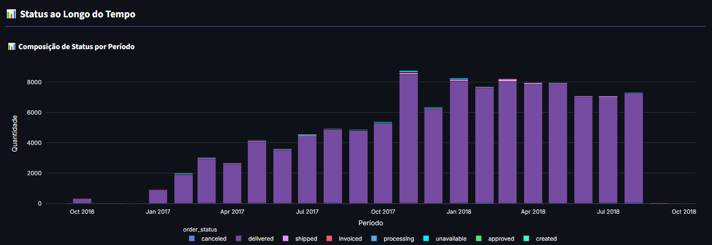
  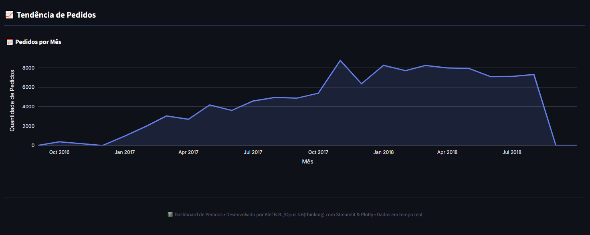
  <br>
  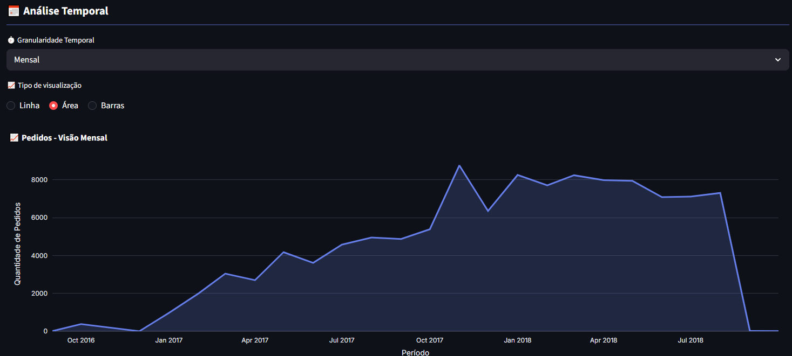
  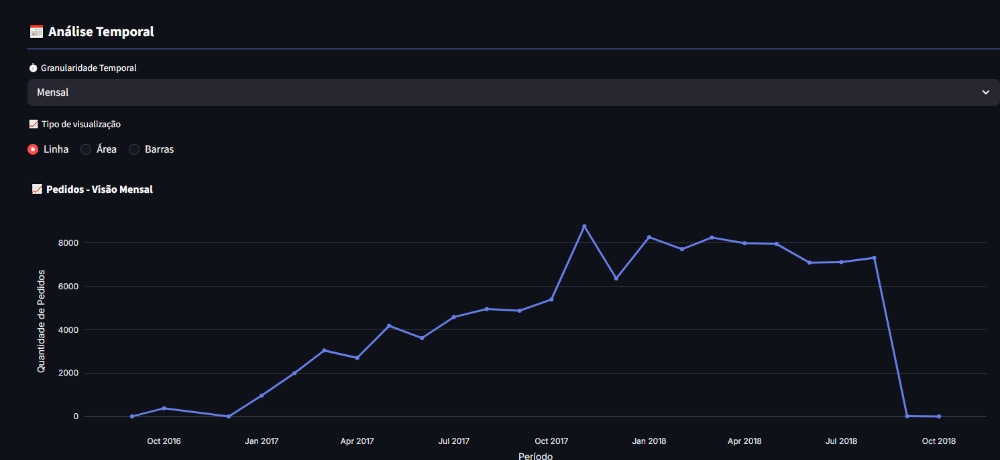
</p>

### 🗺️ Mapas Geográficos
<p align="center">
  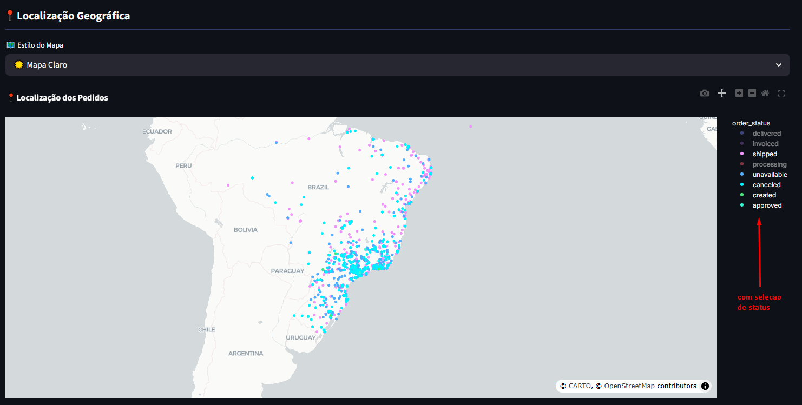
  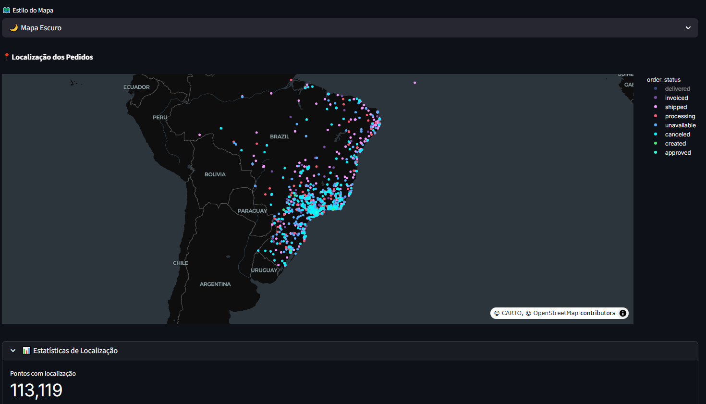
</p>

### 📋 Exportação e Dados Brutos
<p align="center">
  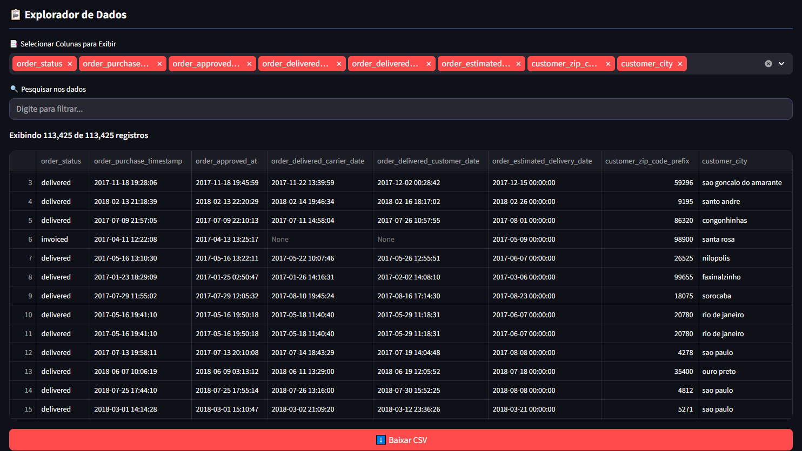
</p>

---

## 🛠️ Bibliotecas Utilizadas

| Biblioteca | Versão | Finalidade |
|---|---|---|
| `streamlit` | 1.56+ | Framework do dashboard web |
| `pandas` | 3.0+ | Manipulação e análise de dados |
| `plotly` | 6.0+ | Gráficos interativos (barras, pizza, mapa, área, etc.) |
| `python-dotenv` | 1.2+ | Carregamento seguro de variáveis de ambiente (`.env`) |
| `psycopg2` | 2.9+ | Conexão com banco PostgreSQL |
| `PyMySQL` | 1.1+ | Conexão com banco MySQL |
| `requests` | 2.33+ | Requisições HTTP para APIs |

---

## 🐸 Método de Busca Anfíbio

O projeto utiliza um **sistema de busca anfíbio** — capaz de buscar dados de **múltiplas fontes** de forma flexível:

| Método | Status | Descrição |
|---|---|---|
| 📄 **CSV via API/URL** | ✅ Implementado | Lê dados de um arquivo CSV hospedado remotamente via URL |
| 🗄️ **SQL (PostgreSQL/MySQL)** | ✅ Implementado | Conexão direta com banco de dados relacional |
| 🔜 **REST API (JSON)** | 🚧 Planejado | Consumo de APIs REST que retornam JSON |
| 🔜 **Google Sheets** | 🚧 Planejado | Leitura de planilhas do Google como fonte de dados |
| 🔜 **Excel Local** | 🚧 Planejado | Upload e leitura de arquivos `.xlsx` locais |

> O sistema foi projetado para ser **extensível** — novos métodos de busca podem ser adicionados na pasta `funcoes/` seguindo o padrão existente.

---

## 📁 Estrutura do Projeto

```
visualizacao_de_dados/
├── app.py                          # Dashboard principal (Streamlit)
├── main.py                         # Script CLI para testes de conexão
├── .env                            # Variáveis de ambiente (NÃO versionado)
├── .gitignore                      # Regras de segurança do Git
├── requirements.txt                # Dependências do projeto
│
├── src/
│   └── css/
│       └── style.css               # CSS personalizado (layout, fontes, cores)
│
├── funcoes/
│   ├── __init__.py
│   ├── api.py                      # Busca dados via CSV/URL (anfíbio)
│   └── funcoes_gerais.py           # Busca dados via SQL (anfíbio)
│
├── db/
│   ├── __init__.py
│   ├── conexao_db.py               # Gerenciador de conexão com banco
│   └── teste_db.py                 # Testes de conexão com banco
│
└── venv/                           # Ambiente virtual (NÃO versionado)
```

### Separação de responsabilidades

- **`app.py`** — Interface visual do dashboard (Streamlit). Contém toda a lógica de renderização, filtros e gráficos.
- **`main.py`** — Script de linha de comando para testar conexões e fazer preview dos dados sem a interface visual.
- **`src/css/`** — CSS separado do Python para manutenção e organização.

---

---

## 🔒 Segurança com `.gitignore`

O arquivo `.gitignore` protege dados sensíveis de serem versionados acidentalmente:

```gitignore
venv/           # Ambiente virtual Python
__pycache__/    # Cache do Python
*.pyc           # Bytecode compilado
.env            # 🔐 Variáveis de ambiente (senhas, URLs, tokens)
```

> ⚠️ O arquivo `.env` contém credenciais de banco de dados e URLs de API. **Nunca** deve ser commitado no repositório.

---

## 🔐 Teste e Conexão com Banco de Dados

A conexão com o banco utiliza **variáveis de ambiente** via `.env` para segurança:

```env
API_URL=https://exemplo.com/dados.csv
DB_HOST=localhost
DB_PORT=5432
DB_NAME=meu_banco
DB_USER=usuario
DB_PASSWORD=senha_segura
```

O script `main.py` permite testar a conexão antes de rodar o dashboard:

```bash
python main.py
```

---

## 🚀 Funcionalidades do Dashboard

| Funcionalidade | Descrição |
|---|---|
| 📊 **Visão Geral** | KPIs, gráfico de pizza/donut e ranking de status |
| 📦 **Análise de Status** | 6 tipos de gráfico selecionáveis (barras, pizza, donut, treemap, funil) |
| 📍 **Mapa Geográfico** | Mapa interativo com estilo claro/escuro |
| 📅 **Histórico Temporal** | Linha do tempo com granularidade diária/semanal/mensal |
| 📋 **Dados Brutos** | Explorador de dados com pesquisa e seleção de colunas |
| 🎛️ **Filtros** | Filtro por status e toggle de período |
| ⬇️ **Download CSV** | Exportação dos dados filtrados |
| 🔄 **Recarregar Dados** | Limpa o cache e busca dados atualizados |
| 🎨 **Temas** | 3 paletas de cor selecionáveis por botão |

---

## 📦 Versionamento

O projeto utiliza **Git** para controle de versão, com repositório hospedado no **GitHub**.

```bash
# Clonar o repositório
git clone https://github.com/AlefTechKai/visualizacao_de_dados.git

# Criar ambiente virtual
python -m venv venv

# Ativar (Windows)
.\venv\Scripts\activate

# Instalar dependências
pip install -r requirements.txt

# Rodar o dashboard
streamlit run app.py
```

---

## 👨‍💻 Desenvolvido por

**Alef B.R.** — com auxílio do Opus 4.6 (Thinking)

Feito com ❤️ usando Streamlit & Plotly
